# Veecom

#### A Simple Yet Powerful RISC-V Computer	

## Table of Contents
* [Introduction](#intro) 
* [Architecture & Organization](#arch_orgi) 
* [RISC-V CPU](#cpu) 
* [Versatile Interface Adapter (VIA)](#via) 
* [Direct Memory Access Controller (DMAC)](#dmac) 
* [uBASIC](#ubasic) 
* [Games](#games) 
* [Memory Map](#mmap) 

Introduction 
--- 

Veecom is a 32-bit computer system that combines the simplicity of 8-bit home computers with modern RISC-V technology, offering users a unique and nostalgic computing experience. It features several notable improvements over the RISC-V Computer 2.0. These include a sleek new design, improved CPU microarchitecture, a new Multi-Cycle CPU version, simplified DMA design, a new replacement for the PIA and a simple BASIC interpreter for an engaging programming experience.

<figure align="center">
    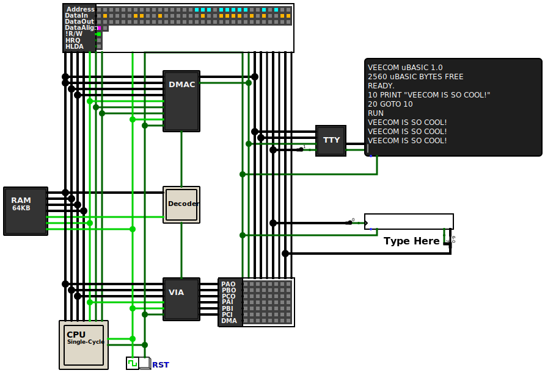
</figure>

Architecture & Organization 
---

Veecom's design follows a Memory-Mapped approach, utilizing an Address Decoder to access hardware components with a total of 64KB of addressable memory. Notably, Veecom introduces the new Versatile Interface Adapter as a replacement for the Peripheral Interface Adapter (PIA) used in the RISC-V Computer 2.0. It features three 8-bit I/O ports that can be used independently for input or output and a new 8-bit timer with similar functionality to `Timer-1` found in the MOS 6522 VIA.
The DMA Controller in Veecom is simpler in design and more compact, supporting up to 64KB of data transfer and addressing capability.

<figure align="center">
    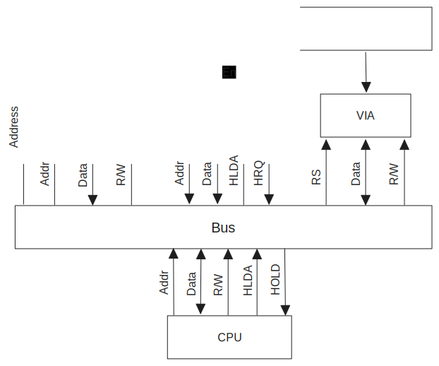
</figure>

RISC-V CPU 
---

Veecom's CPUs are based on the RV32IM variant of the RISC-V ISA, implementing the 32-bit base integer instruction set alongside the M-extension to support hardware multiplication and division. Additionally Veecom introduces a new Multi-Cycle CPU version, complementing the Single-Cycle and 5-Stage pipeline versions pre-existed in the RISC-V Computer 2.0. The new models feature signficant microarchitectural improvements, bug fixes and an overall cleaner design.

#### Single-Cycle Version

<figure align="center">
    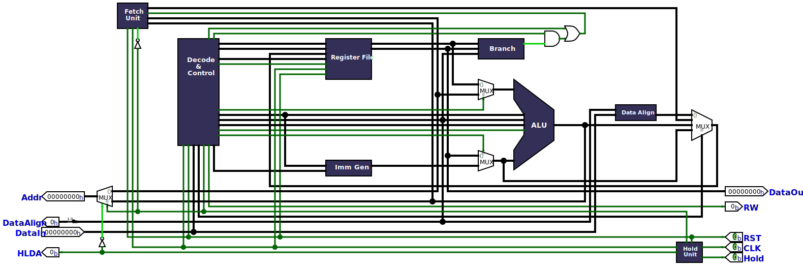
</figure>
 

#### Multi-Cycle Version

<figure align="center">
    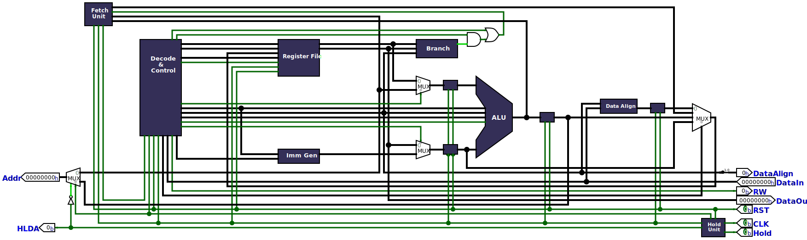
</figure>
 

#### Pipelined Version

<figure align="center">
    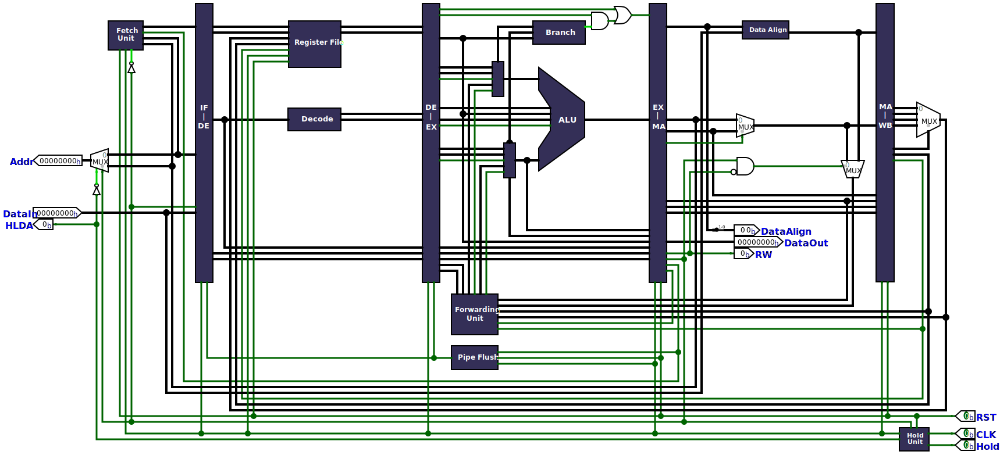
</figure>

Versatile Interface Adapter (VIA) 
---

Inspired by the MOS 6522 VIA, Veecom's VIA features several enhancements and improvements over its predecessor, featuring three 8-bit I/O ports `Port A`, `Port B` and `Port C` that can be used for both input and output without the need for data direction register, allowing for more flexible I/O access (Please refer to [Memory Map](#mmap) section for supported operations).
Additionally, the VIA features a new 8-bit timer similar to Timer-1 found in the MOS 6522 VIA. it supports multiple operation frequencies (up to `f/16`, with `f/2` set as default) and two operations modes, `One-Shot` and `Free-Run`. 

#### Timer Operation

The timer consists of an 8-bit latch and an 8-bit counter. The latch is responsible for storing the data that will be loaded into the counter. The Timer Control Register `TCR` is used to start/stop the timer, configure its operation mode, and set the running clock frequency. Additionally the I/O pin `PC7` can be programmed to invert on every time-out.

#### Timer One-Shot Mode

In One-Shot mode, the content of the latch is loaded into the counter on write, and `PC7` is pulled low until the counter reached zero. When the counter reaches zero, the timer expired flag `TXP` is set and `PC7` is pulled back high, the timer counter is not reloaded. However, when the counter value is equal to value stored in the latch, `PC7` is pulled low again. If timer output on `PC7` is enabled it can be used to generate a programmable pulse width.

#### Timer Free-Run Mode

In Free-Run mode, the timer expired flag is set and `PC7` pin is inverted every time the counter reaches zero, and the content of the latch is loaded into the counter. The timer 
continues to decrement from there. If timer output on `PC7` is enabled it can be used to generate a square wave.

#### Timer Expired Flag (TXP)

The Timer Expired Flag (TXP) indicates if a timer overflow has occurred. Once the timer value reaches zero, the `TXP` flag is asserted and remains asserted unit it is cleared by either reading the flag or writing the Timer Value Register `TVR`.   

#### Timer Control Register (TCR)
This 8-bit register controls the operation of the timer, the following figure lists the functions of the command bits.

<figure align="center">
    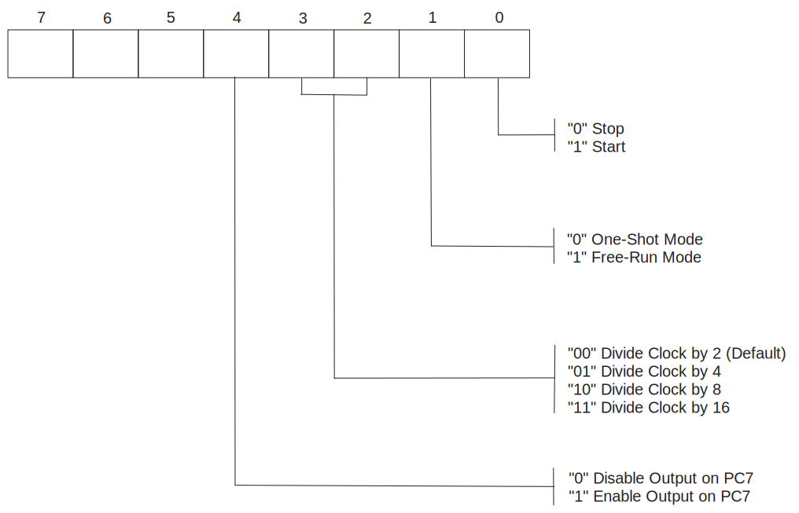
   <figcaption> Timer Control Register (TCR) </figcaption>
</figure>

<figure align="center">
    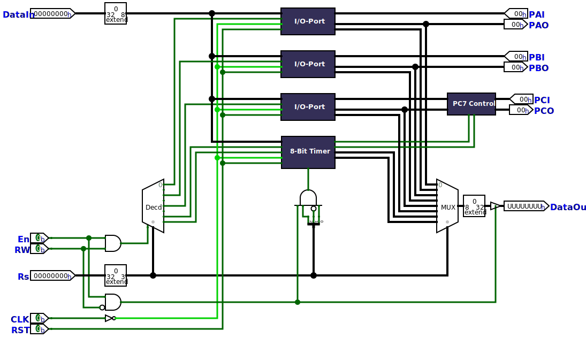
   <figcaption> Versatile Interface Adapter (VIA) </figcaption>
</figure>

Direct Memory Access Controller (DMAC) 
---

The DMA Controller in Veecom is simpler in design and more compact, supporting up to 64KB of data transfer and addressing capability.

#### DMAC Operation

The DMA Controller is designed for fast and efficient `memory-to-IO` data transfer. It features four 8-bit registers: `DSL`, `DSH`, `DAL` and `DAH`, which control the size and address of the data being transferred (Please refer to [Memory Map](#mmap) section for supported operations). The `DSL` and `DSH` registers determine the size of the data, allowing for 16-bit transfers. The `DAL` and `DAH` registers specify the memory location from which data is fetched. Once the `DAH` register is written, the DMA Controller asserts the `HRQ` (Hold Request) pin, signaling the CPU to halt if it's not currently using the system bus. In response, the CPU acknowledges the request by asserting `HLDA` (Hold Acknowledge) pin. The CPU remains halted until the transfer is completed. 

<figure align="center">
    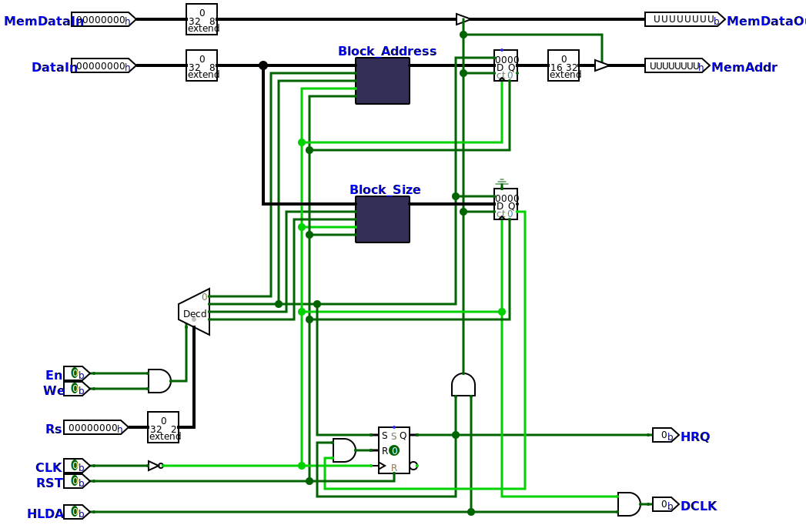
   <figcaption> Direct Memory Access Controller (DMAC) </figcaption>
</figure>

uBASIC 
---

[Veecom uBASIC](https://github.com/MazinCE/Veecom-uBasic) is a derivative of the [uBASIC](https://dunkels.com/adam/ubasic/) interpreter originally authored by Adam Dunkels. This version of uBASIC has been improved to be made fully interactive, with the incorporation of additional commands and performance optimizations.

#### Key Features

Veecom uBASIC supports only the most basic BASIC functionality: `IF/THEN`, `FOR/NEXT`, `LET`, `GOTO`, `GOSUB/RETURN`, `PRINT`, `PEEK`, `POKE` and basic mathematical expressions. There is only support for integer variables and the variables can only have single character names. Note that the support for ELSE and CALL statements has been removed.

#### Additional Features

Veecom uBASIC added support for multiple new commands, these include `RUN`, `LIST`, `NEW`, `FRE`. making it more interactive and user-friendly.
  

#### Example code (Setting and reading the timer value)

    REM CONFIGURE AND START THE TIMER IN ONE-SHOT MODE
    10 LET C = 1
    20 POKE 65535, C
    30 PEEK 65534, T
    40 PRINT T
    50 GOTO 30

<figure align="center">
    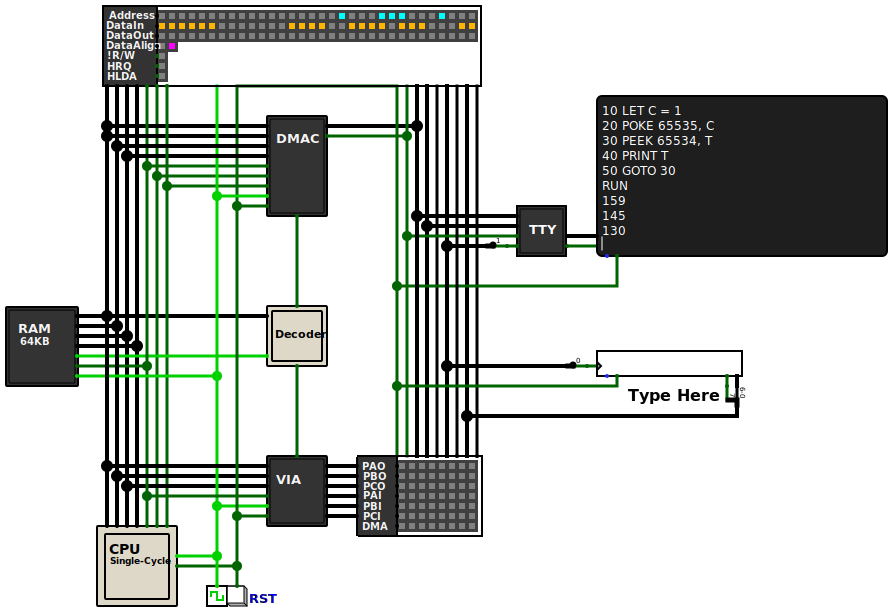
</figure>
 

For more details, please visit [Veecom uBASIC](https://github.com/MazinCE/Veecom-uBasic) repository. 

### Games 

<figure align="center">
    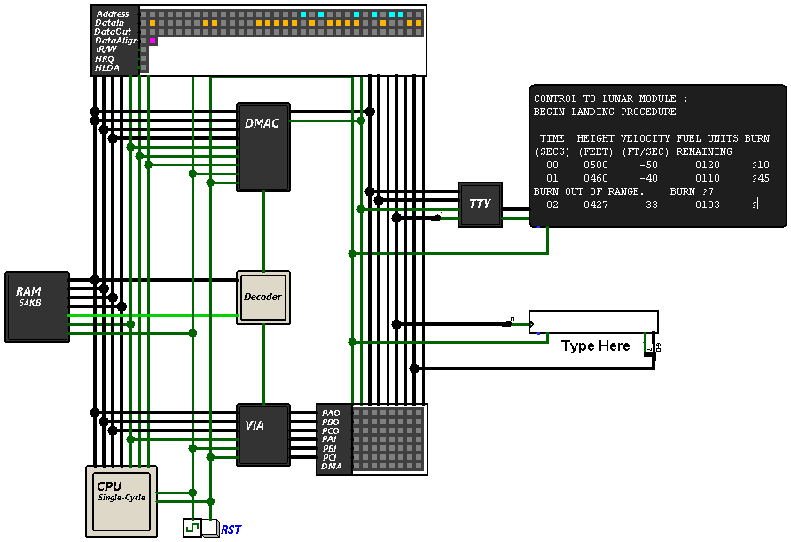
    <figcaption> Lunar Lander (Apple 1 Version 1976)  </figcaption>
</figure>
 
<figure align="center">
    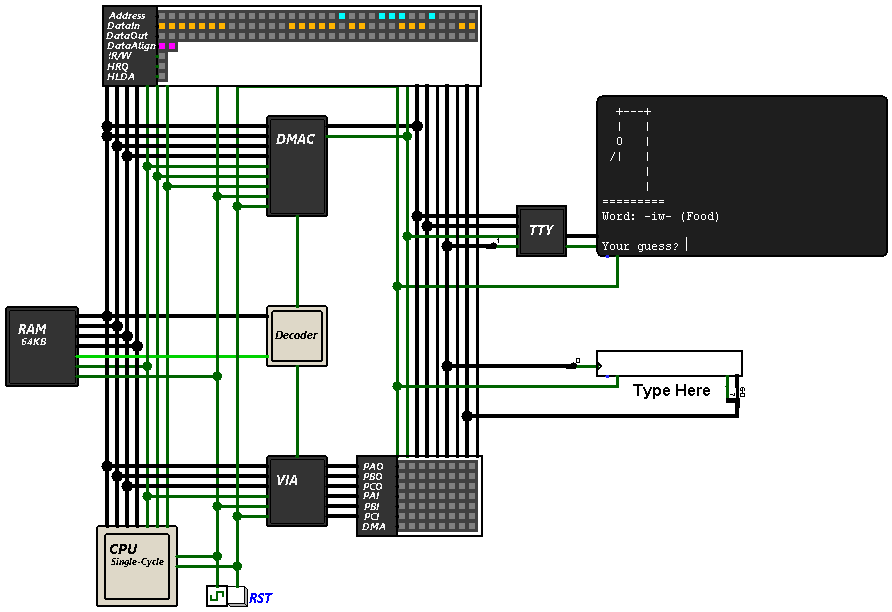
     <figcaption> Hangman </figcaption>
</figure>
 

Memory Map 
---

| Address |   Symbol  | Description           | Supported Operations |
| :----:  |   :----   | :----------------     | :---                 |
| 0xFFFF  | TXP       | Timer Expired Flag    | Read                 |
| 0xFFFF  | TCR       | Timer Control Register| Write                |
| 0xFFFE  | TVR       | Timer Value Register  | Read/Write           |
| 0xFFFD  | PCI       | Port C Input          | Read                 |
| 0xFFFC  | PCO       | Port C Output         | Read/write           |
| 0xFFFB  | PBI       | Port B Input          | Read                 |
| 0xFFFA  | PBO       | Port B Output         | Read/write           |
| 0xFFF9  | PAI       | Port A Input          | Read                 |
| 0xFFF8  | PAO       | Port A Output         | Read/write           |
| 0xFFF7  | DSH       | DMA Block Size Hi     | Write                |
| 0xFFF6  | DSL       | DMA Block Size Lo     | Write                |
| 0xFFF5  | DAH       | DMA Block  Address Hi | Write                |
| 0xFFF4  | DAL       | DMA Block Address Lo  | Write                |
|0x0000 - 0xFFF3 | RAM   | Main Memory        | Read/Write           |    

