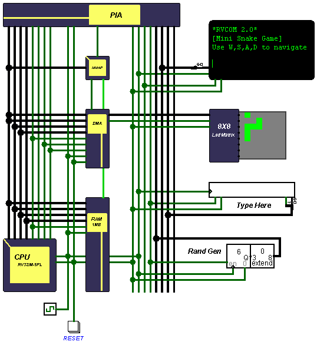

# RISC-V Computer 2.0 (RVCOM 2.0)
An enhanced yet simplified version of the original RISC-V Computer

## Whats new?
	1. Redesigned CPU with two versions to choose from
	   Single-Cycle
	   5-Stage-Pipelined
	2. Simplified Main Memory module
	3. DMA (Direct Memory Access)
	4. Redesigned I/O Interface 

Table of contents  
	1. [Motivation](#motivation) 
	2. [CPU](#cpu) 
	3. [Memory](#memory) 
	4. [DMA (Direct Memory Access)](#dma) 
	5. [PIA (Peripheral Interface Adapter)](#pia) 
	6. [Memory map](#mmap) 
	7. [Loading a program](#program) 

## Motivation 

	The original RISC-V Computer was intended to be a practical approach for understanding computer
	organization and architecture with the help of RISC-V ISA, however the design was overly
	complicated and hard to understand, a matter of fact, understanding how the CPU works will 
	require hours of reverse engineering work neitherless to say the main memory moudule was unnecessarily
	large being 128MB in size divide in 8 diffrent 16MB sized banks and most of all no documentation.
	
	I've made sevral attempts to simplify the orignal design but all ended up failing mainly due to the way
 	the original CPU was designed and implemented "RTL style" so a complete redesign was the only way to go.
 
## CPU 

	Completely redesigned, the new simplified design has a smaller footprint based on
	Von Neumann arhitecture and both CPUs implements the RV32IM extentions.
	it also features hold-holdacknowledge mechanism for DMA support.
	When the hld pin is asserted the CPU sets the hlda signal if it's not currently executing
	any memory related instruction. 
	
	The pipelined version implements the classical 5-Stage RISC pipeline [IF,ID,EX,MA,WB] and supports 
	hazard detection and operand forwarding.
	
### CPU Signle-Cycle

	
### CPU 5-Stage-Pipelined

	 
	   
## Memory 

	The simplified main memory module has been downgraded to 20-bit address space providing
	1MB access for both code and data. 

## DMA (Direct Memory Access) 

	The block transfer memory-to-io DMA is the killer new feature! providing blazing fast
	data transfer with speeds up to 280 byte/s (ON MY MACHINE) and can transfer up to 64KB
	worth of data.
	
	How to use
		The DMA contains three main registers 
			1. Block address register (20-bit)
			2. Block size register (16-bit)
			3. Start transfer strobe
		
		in order to set the address register correctly the 20-bit block address must be 
		sent to DMA as three successive byte writes this also implies to the 16-bit 
		block address register where two successive byte write must be made.

		To start data transfer any arbiray no zero value must to the start transfer strobe register 
		the DMA halts the CPU until the transfer is completed. 
		

	
## PIA (Peripheral Interface Adapter) 

	Inspired by the 6522 PIA the new I/O interface provides a more felixable way for communication 
	with I/O devices having
		* Two perbit programmable 8-bit I/O ports (PRA, PRB) where each bit can be configured
		  as Input or Output individualy by writing to data direction registers (DDRA,DDRB), 
		  writing a value to DDR sets the corrosponding bit as either read only or write only
			"1" Write only
			"0" Read only
   
		* progrmmable 8-bit time with clock prescaler(divide by 1,2,3,4) and two opration modes
			* Continuos-mode
			* Compare-mode
		
			How to use
			    The timer contains four registers
				1. Timer count (8-bit) contains current timer value
				2. Timer compare (8-bit) used for comparition in compare mode
				3. Timer control (8-bit)	used to configure the timer
				4. Timer Flag (overflow) Register
			
			    Timer control register	 	
				[-][-][-][-][PS1][PS0][MOD][ST]
			    
			   ST: Timer Start/Stop (bit 0)
				"0" stop
				"1" start

			   MOD: Timer mode (bit1)
				"0" contious
				"1" compare
			
			   PS1-PS0: Timer prescaler
				"00" divide clock by 1
				"01" divide clock by 2
				"10" divide clock by 3
				"11" divide clock by 4
			     
			Contious-mode 
				In this mode the timer increments until it overflows setting the Timer flag to (0xFF)
				then it wraps around to zero.
				The timer can be loaded with any offset value at any time by writing to Timer count register.  
			
			Compare-mode
				In this mode the count register value is compare with the comare register, if they match
				the Timer flag is set to (0xFF) and the timer count register is reset to back zero.
			
			
			*In both modes the timer countiues to increment until it stoped manulay be the user.
			*The flag register is clear by reading the register value. 
				

			
## Memory Map 
	PIA
		0xFFFF6		TIMER_CONTROL (R/W)
		0xFFFF5		TIMER_COMPARE (W)
		0xFFFF4		TIMER_COUNT   (R/W)
		0xFFFF3		DDRB	      (R/W)
		0xFFFF2		PRB	      (R/W)
		0xFFFF1		DDRA	      (R/W)
		0xFFFF0		PRA	      (R/W)
		
	DMA 
		0xFFFF8		BLOCK_ADDRESS         (W)
		0xFFFF9		BLOCK_SIZE    	      (W)
		0xFFFFA		START_TRANSFER_STROBE (W)
	
	Main Memory 
		0xffeff-0x00000 (can be configured by linker file)	
	

## Loading a program 
	You'll need a RISC-V C/C++ compiler, I personaly use this one for my windows machine https://gnutoolchains.com/risc-v/
	Linker file and startup code must configured correctly take a look at the included demo.
	Load the generated binary file to the memory module.
	
Tested in Logisim-evolution v3.7.2	
	
