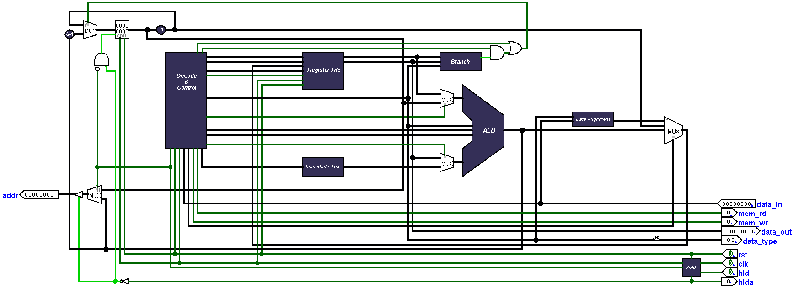
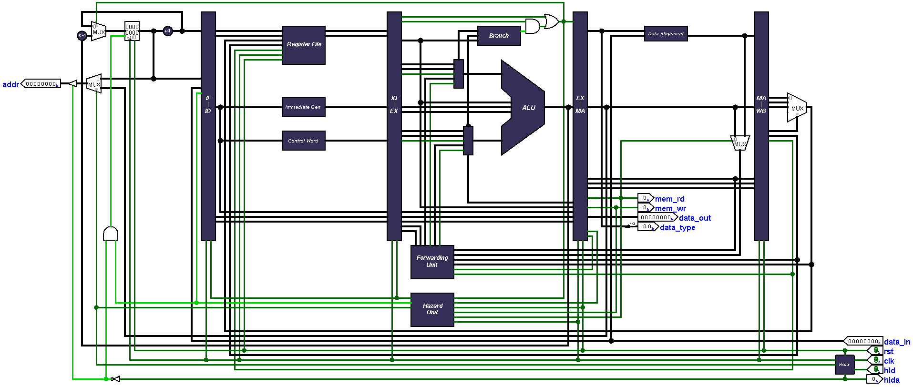
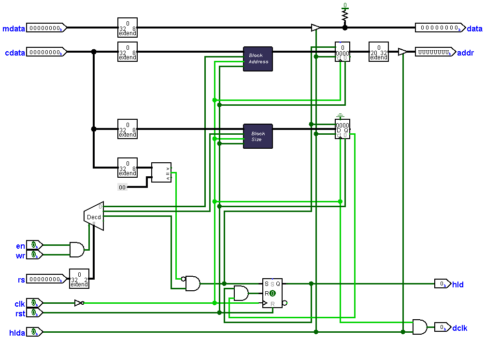
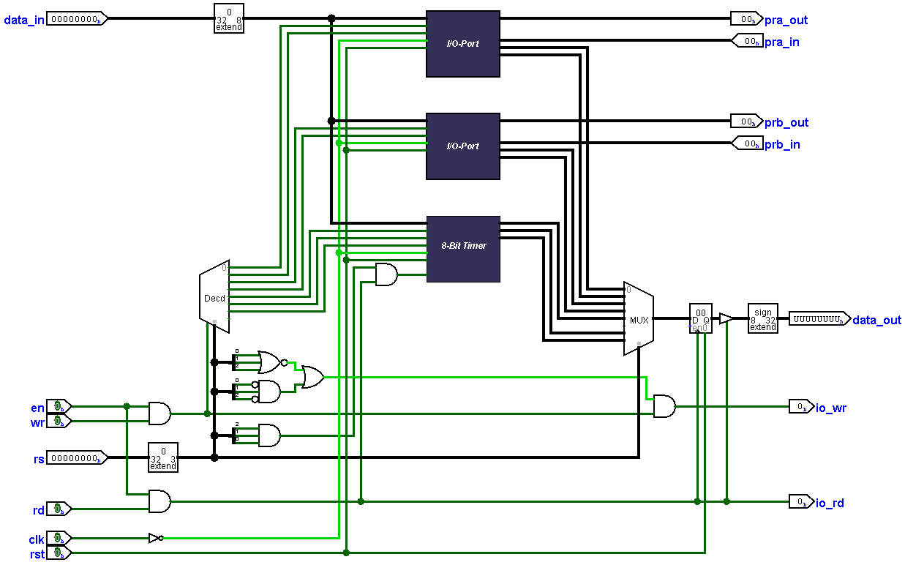
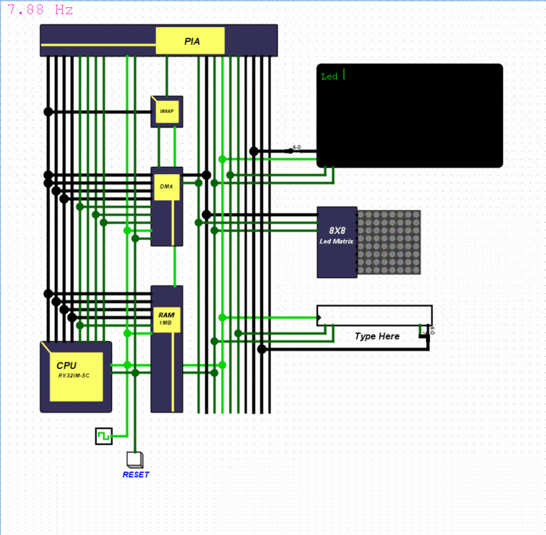

# RISC-V Computer 2.0
An enhanced yet simplified version of the original RISC-V-Computer.

	

	
## What's new?
	1. Redesigned CPU with two versions to choose from
	   Single-Cycle
	   5-Stage-Pipelined
	2. Simplified Main Memory module
	3. DMA (Direct Memory Access)
	4. Redesigned I/O Interface 

## Contents
* [Motivation](#motivation) 
* [CPU](#cpu) 
* [Memory](#memory) 
* [DMA (Direct Memory Access)](#dma) 
* [PIA (Peripheral Interface Adapter)](#pia) 
* [Memory map](#mmap) 
* [Loading a program](#program) 
* [Demo](#demo) 

## Motivation 

	The original RISC-V Computer was intended to be a practical approach for understanding computer
	organization and architecture with the help of RISC-V ISA, however the design was overly
	complicated and hard to understand in fact understanding how the CPU works will 
	require hours of reverse engineering work, worse yet, the main memory module was unnecessarily
	large being 128MB in size divide as 8(eight) 16MB sized banks and worst of all, no design documentation.
	
	I have made several attempts to simplify the original design but all ended up failing, mainly due to the way
 	the original CPU was designed and implemented "RTL style" so a complete redesign was the only way to go.
 
## CPU 

	Completely redesigned, the new simplified design has a smaller footprint-
	based on Von Neumann architecture, and both CPUs implements the RV32IM extensions.              
	it also features hold-hold acknowledge mechanism for DMA support
	When the hld pin is asserted the CPU sets the hlda signal if it's not currently executing
	any memory related instruction. 
	
	The pipelined version implements the classical 5-Stage RISC pipeline [IF, ID, EX, MA, WB] and supports 
	hazard detection and operand forwarding.
	
### Single-Cycle

### 5-Stage-Pipelined

	 
### A note about forwarding
	One case where forwarding cannot help eliminate hazards is when an instruction
	tries to read a register following a load instruction that writes the same register.
	The data is still being read from memory in clock cycle 4 while the ALU is performing
	the operation for the following instruction. hence we must stall the pipeline for the
	combination of load followed by an instruction that reads its result.
	
	But this is not considered an issue in our design, since all memory instructions
	already stall the CPU for one clock cycle due to single memory design. So no need to 
	add any more logic to the Hazard unit regarding that case.  	
#####   [More about forwarding here](https://www.cs.umd.edu/~meesh/411/CA-online/chapter/handling-data-hazards/index.html)
	
## Memory 

	The simplified main memory module has been downgraded to 20-bit address space providing
	1MB access for both code and data. 
	

## DMA (Direct Memory Access) 

	The block transfer memory-to-io DMA is the killer new feature! providing blazing fast
	data transfer with speeds up to 280 bytes/s (speed is host machine dependent) and can transfer up to 64KB
	worth of data.
	
	How to use
		The DMA contains three main registers 
			1. Block address (20-bit)
			2. Block size (16-bit)
			3. Start transfer (strobe)
		
		In order to set the address register correctly the 20-bit block address must be 
		written to DMA as three successive byte writes this also implies to the 16-bit 
		-block address register where two successive byte write must be made.

		To start data transfer any arbitrary non zero value must be written to transfer strobe register. 
		the DMA halts the CPU until data transfer is completed. 
		

	
## PIA (Peripheral Interface Adapter) 

	Inspired by the 6522 PIA the new I/O interface provides a more flexible way for interfacing
	I/O devices. featuring
	
		1. Two per bit programmable 8-bit I/O ports (PRA, PRB) where each bit can be configured
		  as Input or Output individually by writing the data direction registers (DDRA, DDRB), 
		  writing a value to DDR sets the corresponding bit as either read only or write only
			"1" Write only
			"0" Read only
   
		2. A programmable 8-bit timer with clock prescaler (divide by 1,2,3,4) and two operation modes
			 1. Continuous-mode
			 2. Compare-mode
		
			How to use
			    The timer contains four registers
				1. Timer count (8-bit) holds current timer value
				2. Timer compare (8-bit) used for comparison in compare mode
				3. Timer control (8-bit) used to configure the timer
				4. Timer Flag (8-bit) indicates timer overflow 
			
			    Timer control register	 	
				[-][-][-][-][PS1][PS0][MOD][ST]
			    
			   ST: Timer Start/Stop (bit 0)
				"0" stop
				"1" start

			   MOD: Timer mode (bit1)
				"0" continuous
				"1" compare
			
			   PS1-PS0: Timer prescaler
				"00" divide clock by 1
				"01" divide clock by 2
				"10" divide clock by 3
				"11" divide clock by 4
			     
			Continuous-mode 
				In this mode the timer increments until it overflows setting the Timer flag register to (0xFF)
				then it wraps around to zero.
				The timer can be loaded with any offset value at any time by writing to Timer count register.  
			
			Compare-mode
				In this mode the count register value is compared with the compare register, if they match
				the Timer flag is set to (0xFF) and the timer count register is reset to back zero.
			
			
			In both modes the timer continues to increment until it stopped manually be the programmer.
			The flag register is clear by reading the register value. 
				

			
## Memory Map 
	PIA
		0xFFFF7		TIMER_FLAG    (R)
		0xFFFF6		TIMER_CONTROL (R/W)
		0xFFFF5		TIMER_COMPARE (W)
		0xFFFF4		TIMER_COUNT   (R/W)
		0xFFFF3		DDRB	      (R/W)
		0xFFFF2		PRB	      (R/W)
		0xFFFF1		DDRA	      (R/W)
		0xFFFF0		PRA	      (R/W)
		
	DMA 
		0xFFFF8		BLOCK_ADDRESS         (W)
		0xFFFF9		BLOCK_SIZE    	      (W)
		0xFFFFA		START_TRANSFER_STROBE (W)
	
	Main Memory 
		0xFFEFF-0x00000 (can be configured by linker file)	
	
	(R/W) Read and write
	(R)   Read only
	(W)   Write only
	
## Loading a program 
	You'll need a RISC-V C/C++ compiler, I personally use this one for my windows machine https://gnutoolchains.com/risc-v/
	Linker file and startup code must configured correctly take a look at the included demo.
	Load the generated binary file to the memory module.

## Demo

	
	

Tested in Logisim-evolution v3.7.2	
	
