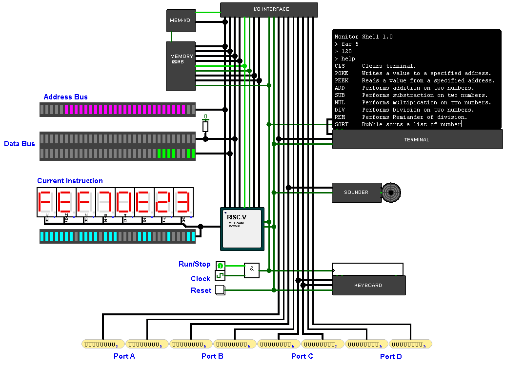

# RISC-V-Computer
A simplified computer build with Logisim capable of running C/C++ programs.

The idea behined this project was to build a bare minimum computer that can run C/C++ programs and simple enough to learn and understand.

## Memory map
0000000 - 07FFFFF Code  
0800000 - 7FFFFFB Data  
7FFFFFC - 7FFFFFF I/O ports  

## The desing of this computer is composed out of four main components:
1. CPU
2. Main memory
3. I/O interface
4. Access coordinator 

## CPU
The CPU is a single-cycle, 32-bit design based on the RISC-V ISA, it also implements the "M" extension for hardware multipication and division.

## Memory
This computer has a single 128MB memory for storing both code and data and due to logisim limitations the memory design was divided into 8 banks with each bank sizing 16MB.

## I/O interface
The I/O interface consists of 4 input ports and 4 output port with each port being 32-bit wide.

## Access coordinator
This module directs CPU Read/Write accesses between Main memory and I/O interface based on the current address generated by the CPU.

## Compiling and Loading C/C++ programs
You'll need a RISC-V C/C++ compiler, I personaly use this one for my windows machine https://gnutoolchains.com/risc-v/

Load the generated binary file into the first bank in the memory module. 

Tested in Logisim-evolution v3.7.2

enjoy :)

